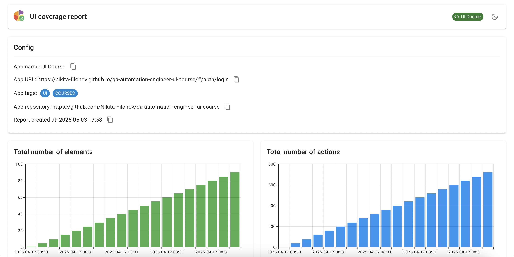
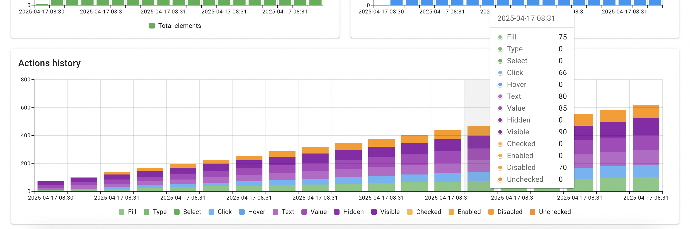
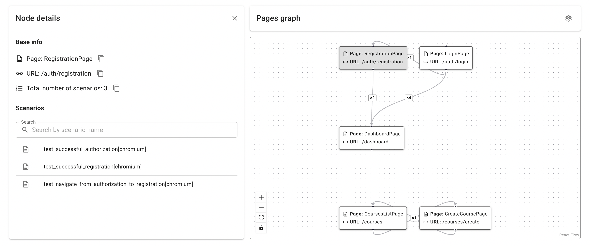
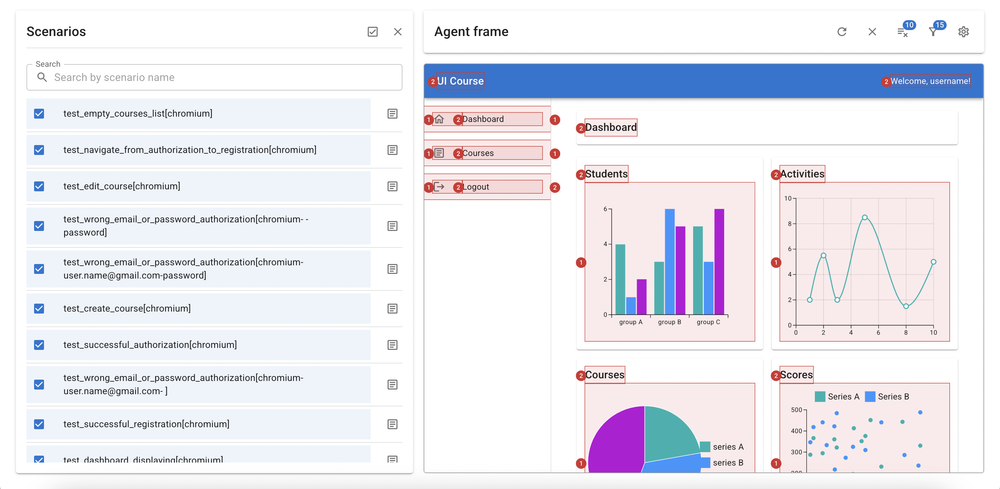
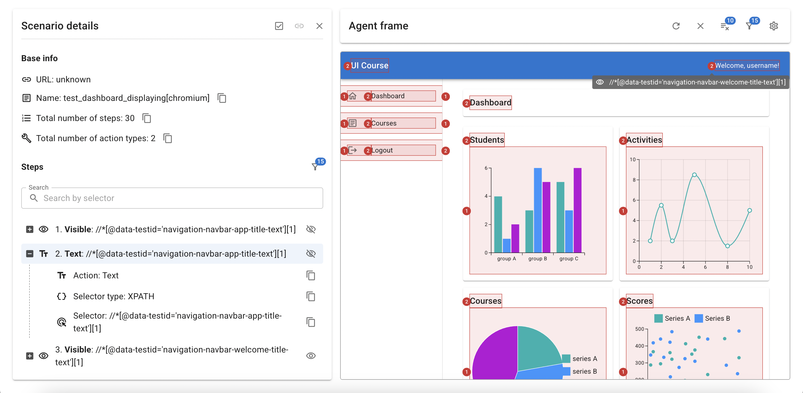
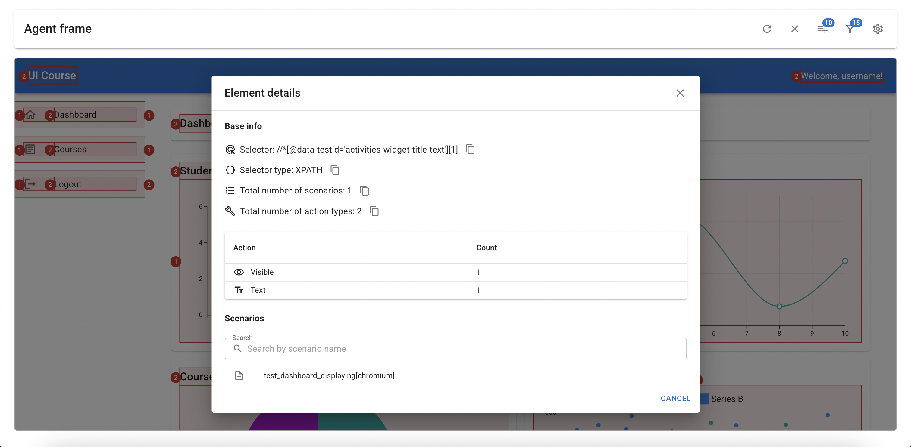

# UI Coverage Scenario Tool

**UI Coverage Scenario Tool** is an innovative, no-overhead solution for tracking and visualizing UI test coverage —
directly on your actual application, not static snapshots. The tool collects coverage during UI test execution and
generates an interactive HTML report. This report embeds a live iframe of your application and overlays coverage data on
top, letting you see exactly what was tested and how.

## Features

- **Live application preview:** The report displays a real iframe of your app, not static screenshots. You can explore
  any page and see which elements were interacted with, what actions were performed, and how often.
- **Flexible frame filters:** Focus only on what matters — filter elements by specific actions (`CLICK`, `FILL`,
  `VISIBLE`, etc.), or action groups. Ideal for analyzing specific scenarios or regression areas.
- **Custom highlight & badge colors:** Easily change the highlight and badge colors used in the iframe for different
  action types or UI states. Great for tailoring the report to your team's visual style or accessibility needs.
- **No framework lock-in:** Works with any UI testing framework (Playwright, Selenium, etc.) by simply logging actions
  via the `trackElement()` method.
- **Element-level statistics:** View detailed statistics by selector: type of action, count of actions, and a timeline
  graph of coverage.
- **Global history overview:** Track historical trends of total coverage and action types across time.
- **Per-element timeline:** Dive deep into the history of interactions for each element — when and how it was used.
- **Full element index:** Searchable table of all elements interacted with during tests, even if you're not sure where
  they are in the UI.
- **Support for visualizing pages in a graph:** The tool offers a unique capability to build a graph of the pages
  involved in tests, as well as the transitions between them.
- **Multi-app support:** Testing multiple domains? No problem. Just list your apps in the config — the report will let
  you switch between them.

## Table of Contents

- [Features](#features)
- [Links](#links)
- [Preview](#preview)
- [About the Tools](#about-the-tools)
- [Why Two Tools?](#why-two-tools)
- [Installation](#installation)
- [Embedding the Agent Script](#embedding-the-agent-script)
- [Usage](#usage)
    - [Playwright](#playwright)
    - [Puppeteer](#puppeteer)
    - [Selenium](#selenium)
    - [Advanced Example](#advanced-example)
    - [Coverage Report Generation](#coverage-report-generation)
    - [Tracker Method Overview](#tracker-method-overview)
- [Configuration](#configuration)
    - [.env](#configuration-via-env)
    - [YAML](#configuration-via-yaml)
    - [JSON](#configuration-via-json)
    - [Reference](#configuration-reference)
- [Command-Line Interface (CLI)](#command-line-interface-cli)

## Links

### Example Report

You can view an example of a coverage report generated by the
tool [here](https://nikita-filonov.github.io/ui-coverage-scenario-tool/).

### Questions & Support

If you have any questions or need assistance, feel free to ask [@Nikita Filonov](https://t.me/sound_right).

## Preview

### Summary



### History



### Pages



### Scenarios



### Scenario Details



### Element Details



## About the Tools

There are two separate tools, each with its own purpose, strengths, and philosophy:

🟢 [ui-coverage-tool-js](https://github.com/Nikita-Filonov/ui-coverage-tool-js) — Simple & Instant Coverage
This is the original tool. It’s designed to be:

- **Extremely simple and fast to integrate**
- **Ideal for quick visibility** into which elements your UI tests are interacting with
- **Perfect for prototyping or smoke-checks**, where deep scenario structure isn’t needed

Think of [ui-coverage-tool-js](https://github.com/Nikita-Filonov/ui-coverage-tool-js) as the lightweight, no-frills
solution for getting instant test coverage insights with minimal setup.

🔵 [ui-coverage-scenario-tool-js](https://github.com/Nikita-Filonov/ui-coverage-scenario-tool-js) — Scenario-Based &
Insightful This is the advanced version of the original tool, built on top of all its features — and more:

- Includes everything from `ui-coverage-tool-js`
- Adds **scenario-level structure**, so your coverage report shows:
    - Which **scenarios** were executed
    - Which **elements** were used in each scenario
    - Which **scenarios** interacted with a given element
- Lets you **link scenarios to TMS test cases** or documentation (e.g. via URLs)
- Offers additional options like:
    - **Iframe zoom settings**
    - **Scenario metadata**
    - **Advanced filtering and analysis**

If your team needs deeper visibility into business processes and scenario
coverage, [ui-coverage-scenario-tool](https://github.com/Nikita-Filonov/ui-coverage-scenario-tool) is the way to go.

## Why Two Tools?

While `ui-coverage-scenario-tool-js` is more powerful, the original `ui-coverage-tool-js` still has a place.

They serve different purposes:

| Tool                           | Best For                                      | Strengths                                     |
|--------------------------------|-----------------------------------------------|-----------------------------------------------|
| `ui-coverage-tool-js`          | Quick setup, lightweight testing environments | Easy to integrate, minimal overhead           |
| `ui-coverage-scenario-tool-js` | Structured E2E scenarios, business test cases | Rich detail, scenario linkage, deeper insight |

Keeping them separate allows users to choose based on **project needs**, **team maturity**, and **desired complexity**.

## Installation

### With npm

```shell
npm install ui-coverage-scenario-tool-js
```

### With yarn

```shell
yarn add ui-coverage-scenario-tool-js
```

## Embedding the Agent Script

To enable live interaction and visual highlighting in the report, you must embed the coverage agent into your
application.

Add this to your HTML:

```html

<script src="https://nikita-filonov.github.io/ui-coverage-scenario-report/agent.global.js"></script>
```

That’s it. No other setup required. Without this script, the coverage report will not be able to highlight elements.

## Usage

Below are examples of how to use the tool with popular UI automation
frameworks: `Playwright`, `Puppeteer`, `Selenium`. In both cases, coverage data is automatically saved to
the `./coverage-results` folder after each call to `await tracker.trackElement(...)`.

### Playwright

```typescript
import { chromium } from 'playwright';
// Import the main components of the tool:
// - UICoverageTracker — the main class for tracking coverage
// - SelectorType — type of selector (CSS, XPATH)
// - ActionType — type of action (CLICK, FILL, CHECK_VISIBLE, etc.)
import { ActionType, SelectorType, UICoverageTracker } from 'ui-coverage-scenario-tool-js';

// Create an instance of the tracker.
// The `app` value should match the name in your UI_COVERAGE_APPS config.
const tracker = new UICoverageTracker({ app: 'my-ui-app' });

(async () => {
  const browser = await chromium.launch();
  const page = await browser.newPage();

  await page.goto('https://my-ui-app.com/login');

  // Start a new scenario with metadata:
  // - url: a link to the test case in TMS or documentation
  // - name: a descriptive scenario name
  tracker.startScenario({ url: 'http://tms.com/test-cases/1', name: 'Successful login' });

  const usernameInput = page.locator('#username-input');
  await usernameInput.fill('user@example.com');

  // Track this interaction with the tracker
  await tracker.trackElement({
    selector: '#username-input',
    selectorType: SelectorType.CSS,
    actionType: ActionType.FILL
  });

  const loginButton = page.locator('//button[@id="login-button"]');
  await loginButton.click();

  // Track the click action with the tracker
  await tracker.trackElement({
    selector: '//button[@id="login-button"]',
    selectorType: SelectorType.XPATH,
    actionType: ActionType.CLICK
  });

  // End the current scenario.
  // This finalizes and saves the coverage data for this test case.
  await tracker.endScenario();

  await browser.close();
})();

```

Quick summary:

- Call `tracker.startScenario(...)` to begin a new scenario.
- Use `await tracker.trackElement(...)` after each user interaction.
- Provide the selector, action type, and selector type.
- The tool automatically stores tracking data as JSON files.
- Once the scenario is complete, call `await tracker.endScenario()` to finalize and save it.

### Puppeteer

```typescript
import puppeteer from 'puppeteer';
import { ActionType, SelectorType, UICoverageTracker } from 'ui-coverage-scenario-tool-js';

const tracker = new UICoverageTracker({ app: 'my-ui-app' });

(async () => {
  const browser = await puppeteer.launch();
  const page = await browser.newPage();

  await page.goto('https://my-ui-app.com/login');

  tracker.startScenario({ url: 'http://tms.com/test-cases/1', name: 'Successful login' });

  await page.type('#username-input', 'user@example.com');
  await tracker.trackElement({
    selector: '#username-input',
    selectorType: SelectorType.CSS,
    actionType: ActionType.FILL
  });

  const loginButton = await page.$x('//button[@id="login-button"]');
  if (loginButton[0]) {
    await loginButton[0].click();
    await tracker.trackElement({
      selector: '//button[@id="login-button"]',
      selectorType: SelectorType.XPATH,
      actionType: ActionType.CLICK
    });
  }

  await tracker.endScenario();
  await browser.close();
})();
```

### Selenium

```typescript
import { Builder, By } from 'selenium-webdriver';
import { ActionType, SelectorType, UICoverageTracker } from 'ui-coverage-scenario-tool-js';

const tracker = new UICoverageTracker({ app: 'my-ui-app' });

(async () => {
  const driver = await new Builder().forBrowser('chrome').build();

  try {
    await driver.get('https://my-ui-app.com/login');

    tracker.startScenario({ url: 'http://tms.com/test-cases/1', name: 'Successful login' });

    const usernameInput = await driver.findElement(By.css('#username-input'));
    await usernameInput.sendKeys('user@example.com');

    await tracker.trackElement({
      selector: '#username-input',
      actionType: ActionType.FILL,
      selectorType: SelectorType.CSS
    });

    const loginButton = await driver.findElement(By.xpath('//button[@id="login-button"]'));
    await loginButton.click();

    await tracker.trackElement({
      selector: '//button[@id="login-button"]',
      actionType: ActionType.CLICK,
      selectorType: SelectorType.XPATH
    });

  } finally {
    await tracker.endScenario();
    await driver.quit();
  }
})();

```

### Advanced Example

This setup demonstrates how to integrate `ui-coverage-scenario-tool-js` with Playwright using **custom fixtures**. The
main idea is to inject a fresh `UICoverageTracker` into each test and pass it explicitly to PageObjects.

This approach is:

- Simple and idiomatic in Playwright
- Compatible with parallel execution
- Free from global state or context magic

#### Step 1: Extend Playwright with a Tracker Fixture

In this step, we use Playwright's `test.extend()` API to define a custom fixture called `tracker`, which:

- Initializes a new `UICoverageTracker` before each test
- Starts a new scenario using metadata from the test
- Provides the tracker to the test (and any object that needs it)
- Ends the scenario automatically after the test finishes

`./tests/base.ts`

```typescript
import { test as base } from '@playwright/test';
import { UICoverageTracker } from 'ui-coverage-scenario-tool-js';

// Define the shape of our custom fixtures.
// Here, we declare that each test will receive a `tracker` of type UICoverageTracker.
type Fixtures = {
  tracker: UICoverageTracker;
};

// Extend the default Playwright test object with the new `tracker` fixture
export const test = base.extend<Fixtures>({
  // The tracker fixture implementation
  async tracker({ page }, use, testInfo) {
    // Instantiate a new UI coverage tracker
    const tracker = new UICoverageTracker({ app: 'ui-course' });

    // Start a new scenario and provide metadata
    tracker.startScenario({
      name: testInfo.title, // Use the test title for traceability
      url: `https://tms.company.com/test-cases/${testInfo.testId || 'manual'}` // Optional link to an external TMS
    });

    // Inject the tracker into the test (and everything that depends on it)
    await use(tracker);

    // Finalize the scenario after test execution
    await tracker.endScenario();
  }
});
```

This fixture ensures a fresh, isolated tracker per test without relying on global state or implicit context.

#### Step 2: Track Coverage Inside PageObjects

Here, we define a `LoginPage` class that performs a UI action and immediately reports it to the tracker.

We pass both the `Page` and the `tracker` to the constructor — making dependencies **explicit and testable.**

`./pages/login-page.ts`

```typescript
import { Page } from '@playwright/test';
import {
  ActionType,
  SelectorType,
  UICoverageTracker
} from 'ui-coverage-scenario-tool-js';

export class LoginPage {
  // Store the Playwright Page and coverage tracker
  constructor(private page: Page, private tracker: UICoverageTracker) {
    // Track that the test has opened this page.
    // Useful for identifying which pages were actually visited during test execution.
    this.tracker.trackPage({
      url: '/auth/login',  // Logical or real URL of the page
      page: 'LoginPage',  // Human-readable name of the page
      priority: 0  // Used to indicate order on the pages graph
    });
  }

  // Method that performs the UI interaction and logs it for coverage
  async clickLoginButton() {
    // Perform the actual user action
    await this.page.click('#login');

    // Log the interaction to the coverage tracker
    await this.tracker.trackElement({
      selector: '#login', // The CSS selector used
      actionType: ActionType.Click, // Action type (click, type, etc.)
      selectorType: SelectorType.CSS // How the selector was defined
    });

    // Track the navigation that follows this interaction.
    // Helps build a picture of the flow between pages.
    await this.tracker.trackTransition({ fromPage: 'LoginPage', toPage: 'DashboardPage' });
  }
}

```

This keeps your UI coverage logic close to the interaction logic, improving observability and maintainability.

#### Step 3: Use the Tracker in a Real Test

Here’s how the test looks with the tracker automatically injected by the fixture and passed to your page objects:

`./tests/important-feature.spec.ts`

```typescript
import { test } from './base';
import { LoginPage } from '../pages/login-page';

// The `tracker` fixture is automatically available here!
test('Should login via the login button', async ({ page, tracker }) => {
  // Pass both page and tracker to the page object
  const loginPage = new LoginPage(page, tracker);

  // Perform the action; the interaction will be logged for coverage
  await loginPage.clickLoginButton();
});
```

The test stays clean and focused — and thanks to the fixture, the tracker lifecycle is fully automated. This makes
interaction tracking an integral part of your UI logic and encourages traceable, observable behavior within
your components and flows. By logging page visits, element interactions, and navigation transitions, your test coverage
becomes more transparent, measurable, and auditable.

#### Why This Approach Works

- **Fixture-driven** — Uses Playwright’s built-in fixture system for clean and idiomatic dependency injection.
- **No globals** — Each test gets an isolated `UICoverageTracker` instance, no shared or static state.
- **Explicit and predictable** — Tracker is passed where needed, which makes dependencies clear and easy to test.
- **Works in parallel** — Tests can run concurrently without interference or leaks.
- **Easily extensible** — You can add more metadata, logging, or scenario management logic without major refactoring.

### Coverage Report Generation

After every call to `await tracker.trackElement(...)`, the tool automatically stores coverage data in
the `./coverage-results/` directory as JSON files. You don’t need to manually manage the folder — it’s created and
populated automatically.

```
./coverage-results/
  ├── 0a8b92e9-66e1-4c04-aa48-9c8ee28b99fa-element.json
  ├── 0a235af0-67ae-4b62-a034-a0f551c9ebb5-element.json
  └── ...
```

When you call `tracker.startScenario(...)`, a new scenario automatically begins. All subsequent actions, such as
`await tracker.trackElement(...)`, will be logged within the context of this scenario. To finalize and save the
scenario, you need to call `await tracker.endScenario()`. This method ends the scenario and saves it to a JSON file.

```
./coverage-results/
  ├── 0a8b92e9-66e1-4c04-aa48-9c8ee28b99fa-scenario.json
  ├── 0a235af0-67ae-4b62-a034-a0f551c9ebb5-scenario.json
  └── ...
```

Once your tests are complete and coverage data has been collected, generate a final interactive report using this
command:

```shell
npx ui-coverage-scenario-tool save-report
```

This will generate:

- `index.html` — a standalone HTML report that you can:
    - Open directly in your browser
    - Share with your team
    - Publish to GitHub Pages / GitLab Pages
- `coverage-report.json` — a structured JSON report that can be used for:
    - Printing a coverage summary in CI/CD logs
    - Sending metrics to external systems
    - Custom integrations or dashboards

**Important!** The `npx ui-coverage-scenario-tool save-report` command must be run from the **root of your project**,
where your config files (`.env`, `ui-coverage-scenario.config.yaml`, etc.) are located. Running it from another
directory may result in missing data or an empty report.

### Tracker Method Overview

#### 🔹 `startScenario`

**Signature:** `startScenario({ url, name }})`

**What it does:** Begins a new UI coverage scenario. This groups all tracked interactions under a single logical test
case.

**When to use:** Call this at the beginning of each test, typically in a fixture or setup block.

**Parameters:**

- `url`: (Optional) External reference to a test case or issue (e.g., link to TMS or ticket)
- `name`: A unique name for the scenario — for example, use `testInfo.title` in `playwright` to tie it to the test title

#### 🔹 `endScenario`

**Signature:** `await endScenario()`

**What it does:** Closes the current scenario and finalizes the coverage data collected for that test case.

**When to use:** Call this at the **end of each test**, usually in teardown logic or after `yield` in a fixture.

#### 🔹 `trackPage`

**Signature:** `await trackPage({ url, page, priority })`

**What it does:** Marks that a particular page was opened during the test. Useful for identifying what screens were
visited and when.

**When to use:** Call once in the constructor of each Page Object, or at the point where the test navigates to that
page.

**Parameters:**

- `url`: Logical or actual route (e.g. `/auth/login`)
- `page`: Readable identifier like `"LoginPage"`
- `priority`: Optional number to order or weigh pages in reports

#### 🔹 `trackElement`

**Signature:** `await trackElement({ selector, actionType, selectorType })`

**What it does:** Tracks interaction with a specific UI element (e.g., click, fill, select).

**When to use:** Call it immediately after performing the user action — so that the test log reflects actual UI
behavior.

**Parameters:**

- `selector`: The selector used in the action (e.g. `#login`)
- `actionType`: The type of action (`CLICK`, `FILL`, etc.)
- `selectorType`: Type of selector (`CSS`, `XPATH`)

#### 🔹 `trackTransition`

**Signature:** `trackTransition({ fromPage, toPage })`

**What it does:** Marks a transition between two logical pages or views.

**When to use:** After an action that leads to navigation (e.g., after login button click that brings you to dashboard).

**Parameters:**

- `fromPage`: Page before the transition
- `toPage`: Page after the transition

#### Why it matters

These methods work together to give a complete picture of what pages, elements, and flows are covered by your tests —
which can be visualized or analyzed later.

## Configuration

You can configure the UI Coverage Tool using a single file: either a YAML, JSON, or `.env` file. By default, the
tool looks for configuration in:

- `ui-coverage-scenario.config.yaml`
- `ui-coverage-scenario.config.json`
- `.env` (for environment variable configuration)

All paths are relative to the current working directory, and configuration is automatically loaded
via [getSettings()](./src/config/core.ts).

**Important!** Files must be in the project root.

### Configuration via `.env`

All settings can be declared using environment variables. Nested fields use dot notation, and all variables must be
prefixed with `UI_COVERAGE_SCENARIO_`.

**Example:** [.env](docs/configs/.env.example)

```dotenv
# Define the applications that should be tracked. In the case of multiple apps, they can be added in a comma-separated list.
UI_COVERAGE_SCENARIO_APPS='[
    {
        "key": "my-ui-app",
        "url": "https://my-ui-app.com/login",
        "name": "My UI App",
        "tags": ["UI", "PRODUCTION"],
        "repository": "https://github.com/my-ui-app"
    }
]'

# The directory where the coverage results will be saved.
UI_COVERAGE_SCENARIO_RESULTS_DIR="./coverage-results"

# The file that stores the history of coverage results.
UI_COVERAGE_SCENARIO_HISTORY_FILE="./coverage-history.json"

# The retention limit for the coverage history. It controls how many historical results to keep.
UI_COVERAGE_SCENARIO_HISTORY_RETENTION_LIMIT=30

# Optional file paths for the HTML and JSON reports.
UI_COVERAGE_SCENARIO_HTML_REPORT_FILE="./index.html"
UI_COVERAGE_SCENARIO_JSON_REPORT_FILE="./coverage-report.json"
```

### Configuration via YAML

**Example:** [ui-coverage-scenario.config.yaml](docs/configs/ui-coverage-scenario.config.yaml)

```yaml
apps:
  - key: "my-ui-app"
    url: "https://my-ui-app.com/login",
    name: "My UI App"
    tags: [ "UI", "PRODUCTION" ]
    repository: "https://github.com/my-ui-app"

resultsDir: "./coverage-results"
historyFile: "./coverage-history.json"
historyRetentionLimit: 30
htmlReportFile: "./index.html"
jsonReportFile: "./coverage-report.json"
```

### Configuration via JSON

**Example:** [ui-coverage-scenario.config.json](docs/configs/ui-coverage-scenario.config.json)

```json
{
  "apps": [
    {
      "key": "my-ui-app",
      "url": "https://my-ui-app.com/login",
      "name": "My UI App",
      "tags": [
        "UI",
        "PRODUCTION"
      ],
      "repository": "https://github.com/my-ui-app"
    }
  ],
  "resultsDir": "./coverage-results",
  "historyFile": "./coverage-history.json",
  "historyRetentionLimit": 30,
  "htmlReportFile": "./index.html",
  "jsonReportFile": "./coverage-report.json"
}
```

### Configuration Reference

| Key                     | Description                                                               | Required | Default                   |
|-------------------------|---------------------------------------------------------------------------|----------|---------------------------|
| `apps`                  | List of applications to track. Each must define `key`, `name`, and `url`. | ✅        | —                         |
| `services[].key`        | Unique internal identifier for the service.                               | ✅        | —                         |
| `services[].url`        | Entry point URL of the app.                                               | ✅        | —                         |
| `services[].name`       | Human-friendly name for the service (used in reports).                    | ✅        | —                         |
| `services[].tags`       | Optional tags used in reports for filtering or grouping.                  | ❌        | —                         |
| `services[].repository` | Optional repository URL (will be shown in report).                        | ❌        | —                         |
| `resultsDir`            | Directory to store raw coverage result files.                             | ❌        | `./coverage-results`      |
| `historyFile`           | File to store historical coverage data.                                   | ❌        | `./coverage-history.json` |
| `historyRetentionLimit` | Maximum number of historical entries to keep.                             | ❌        | `30`                      |
| `htmlReportFile`        | Path to save the final HTML report (if enabled).                          | ❌        | `./index.html`            |
| `jsonReportFile`        | Path to save the raw JSON report (if enabled).                            | ❌        | `./coverage-report.json`  |

### How It Works

Once configured, the tool automatically:

- Tracks test coverage during UI interactions.
- Writes raw coverage data to `coverage-results/`.
- Stores optional historical data and generates an HTML report at the end.

No manual data manipulation is required – the tool handles everything automatically based on your config.

## Command-Line Interface (CLI)

The UI Coverage Tool provides several CLI commands to help with managing and generating coverage reports.

### Command: `save-report`

Generates a detailed coverage report based on the collected result files. This command will process all the raw coverage
data stored in the `coverage-results` directory and generate an HTML report.

**Usage:**

```shell
npx ui-coverage-scenario-tool save-report
```

- This is the main command to generate a coverage report. After executing UI tests and collecting coverage data, use
  this command to aggregate the results into a final report.
- The report is saved as an HTML file, typically named index.html, which can be opened in any browser.

### Command: `print-config`

Prints the resolved configuration to the console. This can be useful for debugging or verifying that the configuration
file has been loaded and parsed correctly.

**Usage:**

```shell
npx ui-coverage-scenario-tool print-config
```

- This command reads the configuration file (`ui-coverage-scenario.config.yaml`, `ui-coverage-scenario.config.json`,
  or `.env`)
  and prints the final configuration values to the console.
- It helps verify that the correct settings are being applied and is particularly useful if something is not working as
  expected.

## Troubleshooting

### The report is empty or missing data

- Ensure that `startScenario()` is called before the test.
- Ensure that `endScenario()` is called after the test.
- Ensure that `trackPage()`, `trackElement()`, `trackTransition()` is called during your test.
- Make sure you run `npx ui-coverage-scenario-tool save-report` from the root directory.
- Make sure to setup configuration correctly.
- Check that the `coverage-results` directory contains `.json` files.